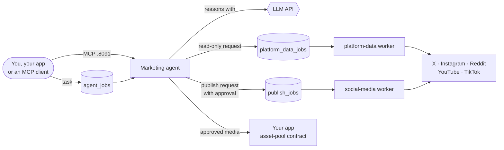

# MarketingPool

**A marketing agent, the open pool of capabilities it draws on, and a Docker setup that runs all of it on your own machine.**

[](#license)
[](#quick-start)
[](./agent)
[](./marketing-agent-assets)
[](#talk-to-the-agent)
[](./docker/README.md)
[](#open-contribution)

Most marketing work is repeatable: collect data, make an asset, publish it, look at the result. This repository keeps the **thinking** (an LLM agent), the **doing** (small workers that hold credentials and talk to platforms) and the **shared building blocks** (platform toolboxes, schemas, decision guides) separate, so each can be understood, tested and replaced on its own.

## Contents

- [What is in here](#what-is-in-here)
- [How the pieces fit](#how-the-pieces-fit)
- [Quick start](#quick-start)
- [Talk to the agent](#talk-to-the-agent)
- [Configuration](#configuration)
- [What has been tested](#what-has-been-tested)
- [Open contribution](#open-contribution)
- [Getting help](#getting-help)
- [License](#license)

## What is in here

| Folder | What it is |
| --- | --- |
| [`agent/`](./agent) | **The marketing agent (Mimar).** An orchestrator LLM that hands work to specialised sub-agents: social media, content creation, asset collection, platform data. It runs as a worker: it polls a job queue and also serves MCP. Talks to OpenAI-compatible model APIs: tested with DeepSeek; Gemini and Kimi/Moonshot are supported in the code. |
| [`marketing-agent-assets/`](./marketing-agent-assets) | **The open pool.** Queue workers (publishing, scheduling, read-only platform data, MCP), official-API toolboxes for X, Instagram, Reddit, YouTube and TikTok, an app-connection kit (`asset-pool`), shared JSON schemas, LLM decision guides (skills) and examples. |
| [`docker-compose.yml`](./docker-compose.yml) · [`docker/`](./docker) | Runs the agent and the workers together on one machine, with a **local queue** (Postgres + PostgREST) where a hosted Supabase would normally be. |
| [`manifesto.md`](./manifesto.md) | Why these pieces exist and how they relate. |

## How the pieces fit



Two ideas hold it together:

- **The agent never holds platform credentials.** It writes a request to a queue. A worker that owns the credentials checks the request and acts. The data worker only runs actions on an allowlist declared in each toolbox's manifest, and every one of them is read-only.
- **Anything that changes the outside world needs approval.** Publishing, replying, following and similar actions are gated at call time, not just in a prompt.

## Quick start

**You need:** Docker with the Compose plugin (`docker compose version`), Python 3 (only to generate local secrets), a model API key, and about 3 GB of disk for the images.

```bash
git clone https://github.com/Ahmet2001/MarketingPool.git
cd MarketingPool

python3 docker/make_env.py                    # writes .env with local queue secrets (never committed)
cp env/agent.env.example env/agent.env        # then edit it: put your model key in (see Configuration)

docker compose up -d --build queue platform-data-worker social-media-worker agent
docker compose logs -f agent
```

The agent is ready when its log shows `agent_jobs kuyrugu dinleniyor` and `MCP sunucusu`.

Stop with `docker compose stop` (keeps the queue's data) or `docker compose down -v` (deletes it).

## Talk to the agent

**Through the queue.** Any process that can make an HTTP call can hand the agent a task:

```bash
KEY=$(grep ^SERVICE_KEY .env | cut -d= -f2)

curl -X POST http://127.0.0.1:54321/rest/v1/agent_jobs \
  -H "apikey: $KEY" -H "Authorization: Bearer $KEY" -H "Content-Type: application/json" \
  -d '{"payload": {"task": "Say hello in one word."}}'

curl "http://127.0.0.1:54321/rest/v1/agent_jobs?select=status,results&order=created_at.desc&limit=1" \
  -H "apikey: $KEY" -H "Authorization: Bearer $KEY"
```

**Through MCP.** The agent also serves [MCP](https://modelcontextprotocol.io) over HTTP at `http://127.0.0.1:8091/mcp`, authenticated with `Authorization: Bearer <AGENT_MCP_TOKEN>` (the value is in your `.env`).

**Look at the queue.** `docker compose exec db psql -U postgres -c "select status, count(*) from agent_jobs group by 1"`.

## Configuration

Nothing secret is committed. `.env` and everything in `env/*.env` are git-ignored; only the `*.example` files are in the repository.

| File | Holds | Notes |
| --- | --- | --- |
| `.env` (made by `docker/make_env.py`) | Secrets of the **local queue** | Local only. They are not Supabase credentials. |
| `env/agent.env` | The agent's model and settings | Start from [`env/agent.env.example`](./env/agent.env.example). |
| `env/platform-data-worker.env` | Platform credentials for read-only data, e.g. `YOUTUBE_API_KEY` | Optional until you collect that platform's data. |
| `env/social-media-worker.env` | Platform credentials for publishing | Optional until you publish. |

**Choosing the model.** The agent talks to OpenAI-compatible APIs. The example file is set up for DeepSeek, the only provider tested here. Two things in the code are easy to trip over:

- For every provider other than `gemini`, the key is read from **`MOONSHOT_API_KEY`** (or `KIMI_API_KEY`). Put your DeepSeek key there; the name is odd, the value is yours.
- Three inactive sub-agents build a Gemini client at start-up and crash without a value, so keep `GEMINI_API_KEY=unused-placeholder` unless you enable them.

More detail, including how the Docker images differ from the sources, is in [`docker/README.md`](./docker/README.md).

## What has been tested

Checked on one Linux laptop with the Docker setup above:

- The queue's migrations apply, and the REST API answers with the service key and refuses without it.
- A task queued for the agent is claimed, sent to the model, and the answer is written back.
- The agent delegates a data request to `platform_data_agent`, which queues a correct `platform_data_jobs` row; the worker runs it against the manifest allowlist and refuses a write action.
- The agent produces a real 1600×900 PNG post with headless Chromium inside the container.
- The publishing worker claims a job and writes a result.

**Not tested:** real publishing (needs real platform credentials and public https media URLs), real data from a platform (needs its API key; only the "missing key" path was exercised), `scheduler-worker` and `mcp-worker` (they drive a backend that is not part of this repository; start them with `docker compose --profile backend up`), and the browser and screen tools, which are inactive by default.

**Known issue:** when the queue is empty, the claim functions return a row of `null`s. The Python workers handle it; `social-media-worker/adapters/supabase.js` treats it as a job and logs an error on every poll. The fix is one line, described in [`docker/README.md`](./docker/README.md#known-quirk).

## Open contribution

The workers are the part that runs, but a main idea of this project is an **open pool**: a place where people add and share marketing capabilities, so nobody rebuilds the same platform integration or decision guide alone. Most of the pool is declarative, so you can contribute without touching a worker: a new platform action in a toolbox manifest, a read-only data action, a `SKILL.md` decision guide, a schema, or a connection to your own app through the `asset-pool` kit.

The full table of where each kind of contribution goes, and the rules every one must follow, is in [`marketing-agent-assets/README.md`](./marketing-agent-assets/README.md#open-contribution) and [`CONTRIBUTING.md`](./marketing-agent-assets/CONTRIBUTING.md).

## Getting help

Open an [issue](https://github.com/Ahmet2001/MarketingPool/issues) with what you ran, what you expected and the relevant log lines (`docker compose logs <service>`). Please remove keys and tokens from anything you paste.

Maintained by [@Ahmet2001](https://github.com/Ahmet2001).

Related project: [MarketingStudio](https://github.com/Ahmet2001/MarketingStudio), a workflow factory whose exported workflows can run on these workers.

## License

Each part carries its own MIT license: [`agent/LICENSE`](./agent/LICENSE) and [`marketing-agent-assets/LICENSE`](./marketing-agent-assets/LICENSE) (their copyright lines differ). Read [`marketing-agent-assets/SOURCE_NOTICE.md`](./marketing-agent-assets/SOURCE_NOTICE.md) before reusing the platform toolboxes. Platform terms, user consent and authorisation for every external write remain the integrator's responsibility.
