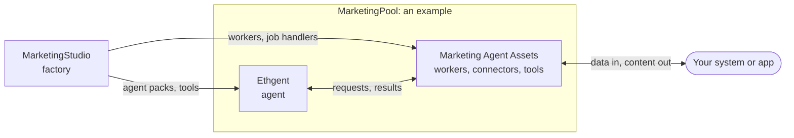

# Marketing Agent Assets

[](./LICENSE)
[](./future_work.md)

**The connection between an LLM agent and your system, and an open pool that anyone can add to.**

An agent is only useful inside a system if it can read what happens there and act on it. This repository holds the pieces that make that connection: workers that hold credentials and talk to platforms, connectors and toolboxes, a small contract for exposing your own app, shared schemas and decision guides. Use any of them on their own, or combine them with an agent such as [Ethgent](../agent). The [manifesto](../manifesto.md) explains why the pieces are separate.

## What it is for

- **Connect an agent to a system.** The agent never holds platform credentials or database access. It writes a validated request; a worker that owns the credentials checks it and acts. Your app stays the source of truth.
- **Close the loop.** With the agent and these assets joined, the model gets feedback (it can read your data and platform data) and can give something back (publish, or write into your app). Connected to your app, it can collect material from it, create content and publish it.
- **Be shared.** There is no single "asset". Anyone can add their own tool, connector, worker, guide or app connection, so nobody rebuilds the same integration alone. This open, shared character is a core part of the project (see [Open contribution](#open-contribution)).

It is not a placeholder for something else. It is the part of the system that makes an agent usable outside its own process.

## Where it sits

Four repositories, one idea: **fit an LLM agent to your own system.**

| Repository | Role |
| --- | --- |
| [**Ethgent**](https://github.com/Ahmet2001/BrowserAgent) | The customisable agent: an orchestrator, sub-agents and tools that live in YAML and packs. Tuned for social media today; the same shape can be fitted to other domains. A separate project that stands on its own. |
| **Marketing Agent Assets** (this repository) | The connection and the open pool: workers, connectors, toolboxes, contracts, guides. |
| [**MarketingStudio**](https://github.com/Ahmet2001/MarketingStudio) | The factory. Build a workflow once, export it as an agent pack, MCP server, worker and more, and feed it to the agent and the assets. |
| [**MarketingPool**](https://github.com/Ahmet2001/MarketingPool) | A worked example: the agent and these assets together, running with Docker. |



## What has been checked

The worker, toolbox, schema, example and skill layers are available. The agent is wired to the worker's `publish_jobs` queue for its two supported actions (`video.publish`, `instagram.carousel`), with an approval gate and idempotency keys in front of it. [`asset-pool/`](./asset-pool) is a contract and kit any app can implement (`collect_assets` is required; `prepare_media` and `request_video_generation` are optional); one real app has it wired into its own server, checked over HTTP ([example](./asset-pool/examples/karatahta/README.md)). [`platform_data_worker/`](./platform_data_worker) is a standalone worker for read-only platform data that refuses anything not on the per-platform allowlist in each `toolboxes/*/manifest.yaml`. What is real and what still needs live credentials is listed in [`agent/AGENT.md`](../agent/AGENT.md). Real publishing and real platform data have not been run.

## Open contribution

The workers are the part that runs, but they are not the whole point. A main idea of this project is an **open pool**: a place where people add and share marketing capabilities, so nobody has to rebuild the same platform integration, decision guide or app connection alone.

Most of what is here is declarative on purpose, so you can contribute without touching any worker:

| You want to add | Where it goes | What makes it a good contribution |
| --- | --- | --- |
| A platform, or an action on one | [`toolboxes/<platform>/`](./toolboxes) and its `manifest.yaml` | Declare the action in the manifest before exposing it. Mark it `api` or `browser`. Say which OAuth scopes and environment variables it needs, its rate limits, and whether it writes external state. |
| A read-only data action for the agent | `data_collection.actions` in the toolbox manifest | A `get_`, `search_` or `list_` function with typed, bounded parameters. Anything not listed there stays refused by [`platform_data_worker/`](./platform_data_worker). |
| A decision guide for the LLM | [`skills/<name>/SKILL.md`](./skills) | A guide for deciding, not executing: when to use it, what to check, what to refuse. |
| A shared contract | [`schemas/`](./schemas) | Keep existing schemas intact. A breaking change is a new schema version. |
| A connection to **your own app** | [`asset-pool/`](./asset-pool) | Implement the small endpoint contract and prove it with the included conformance checker. The pool is not tied to one app: Kara Tahta is only a worked example. |
| A queue other than Supabase | A module for the worker's `QUEUE_ADAPTER_MODULE` | Export `claimNextJob`, `finishJob` and `failJob`. |
| A worked example | [`examples/`](./examples) | Small, portable, no secrets. |

What every contribution has to respect (details in [CONTRIBUTING.md](./CONTRIBUTING.md)):

- Anything that publishes, replies, follows, votes or otherwise affects a third-party account needs application-level authorization at call time.
- No secrets, browser profiles, tokens, downloaded media or user data.
- Capabilities stay independent of any single app, so others can reuse them as they are.

## What is included

| Area | What it provides |
| --- | --- |
| [`social-media-worker/`](./social-media-worker) | Node.js queue worker for video publishing and Instagram carousels. |
| [`agent/`](../agent) | Tool-calling LLM orchestrator that creates content and queues schema-valid publish jobs onto the worker. See its [`AGENT.md`](../agent/AGENT.md). |
| [`asset-pool/`](./asset-pool) | Dependency-free kit + conformance checker for exposing **your own app's** approved media, media preparation, and video-generation endpoints to the agent. Kara Tahta is included only as a worked example. |
| [`platform_data_worker/`](./platform_data_worker) | Standalone worker that holds platform credentials and answers read-only data requests from the agent, checked against a manifest allowlist. |
| [`toolboxes/`](./toolboxes) | Official-API and supervised-browser capabilities for X, Instagram, Reddit, YouTube, and TikTok. Each API toolbox also declares its `data_collection` read-only allowlist for `platform_data_worker`. |
| [`skills/`](./skills) | LLM decision guides for strategy, repurposing, publishing, engagement, and analysis. |
| [`schemas/`](./schemas) | Shared JSON contracts for assets, publish requests, and publish results. |
| [`examples/`](./examples) | Small, portable examples for campaigns, scheduling, and cross-platform content. |
| [`future_work.md`](./future_work.md) | Planned app → worker environment → agent transition. |

## Quick start: publish with the worker

The worker is intentionally independent of any specific app. Your backend creates a queue job with an HTTPS asset URL; the worker claims and publishes it.

```bash
git clone https://github.com/Ahmet2001/MarketingPool.git
cd MarketingPool/marketing-agent-assets/social-media-worker
cp .env.example .env
npm install
```

Apply [`migrations/001_publish_jobs.sql`](./social-media-worker/migrations/001_publish_jobs.sql) to the Supabase database used by the default adapter, configure the required platform credentials in `.env`, then run:

```bash
npm start
```

Create a video publishing job:

```json
{
  "action": "video.publish",
  "videoUrl": "https://cdn.example.com/launch.mp4",
  "title": "Launch day",
  "caption": "We are live.",
  "platforms": ["instagram", "youtube"],
  "privacyStatus": "public",
  "credentialRef": "brand-primary"
}
```

For a 2–10 slide Instagram carousel, submit `action: "instagram.carousel"` with HTTPS JPEG `imageUrls`. See the [cross-platform example](./examples/cross-platform-content/instagram-carousel.json) and the worker [README](./social-media-worker/README.md).

## Toolboxes: API first, browser supervised

Every platform toolbox is physically split into two modules:

```text
toolboxes/<platform>/
├── api/toolbox.py       # official API surface; production integration path
├── browser/toolbox.py   # Selenium; human-supervised local use only
├── manifest.yaml        # environment names, OAuth scopes, rate limits, actions
└── README.md
```

Use only `api/toolbox.py` in production workflows. Browser modules require an interactive signed-in session and must not be attached to a background worker. Check each platform’s `manifest.yaml` before enabling an action.

## Skills: decision quality, not execution

Skills are compact LLM instruction assets. They guide a marketing agent or another LLM integration; the worker does **not** load skills during publishing.

- [`social-content-strategy`](./skills/social-content-strategy/SKILL.md) — positioning, pillars, cadence, and experiments.
- [`content-repurposing`](./skills/content-repurposing/SKILL.md) — transform approved assets into clips, carousel narratives, and briefs.
- [`cross-platform-publishing`](./skills/cross-platform-publishing/SKILL.md) — adapt content and prepare schema-valid publish requests.
- [`community-engagement`](./skills/community-engagement/SKILL.md) — triage responses and escalate sensitive interactions.
- [`campaign-analysis`](./skills/campaign-analysis/SKILL.md) — interpret metrics and propose the next test.

## Shared contracts

Use the schemas as the boundary between applications, workers, toolboxes, and future agents:

- [`asset.schema.json`](./schemas/asset.schema.json) — approved media asset metadata (served by an [asset pool](./asset-pool)).
- [`publish_request.schema.json`](./schemas/publish_request.schema.json) — actions a worker may execute.
- [`publish_result.schema.json`](./schemas/publish_result.schema.json) — normalized execution outcome.
- [`media_prepare_request.schema.json`](./schemas/media_prepare_request.schema.json) — asset pool's optional `prepare_media` request body.
- [`video_generation_request.schema.json`](./schemas/video_generation_request.schema.json) / [`video_generation_status.schema.json`](./schemas/video_generation_status.schema.json) — asset pool's optional `request_video_generation` request/status.
- [`platform_data_request.schema.json`](./schemas/platform_data_request.schema.json) / [`platform_data_result.schema.json`](./schemas/platform_data_result.schema.json) — `platform_data_worker`'s manifest-approved read request/result.

Credentials, database access, and private signed URLs must never enter an LLM prompt or a public job payload.

## Boundaries

The worker owns a narrow, explainable algorithmic bridge: validation, media preparation, platform-format checks, queue execution, retries and results. Strategy and engagement decisions belong to the agent and, for anything that affects an outside account, to an approval by a person. The worker must not become an autonomous strategy or engagement engine. See [future_work.md](./future_work.md) for the phased plan.

## Contributing

Contributions are welcome, and they are a core part of the project, not an afterthought: see [Open contribution](#open-contribution) for what you can add. Read [CONTRIBUTING.md](./CONTRIBUTING.md) before opening a change. In particular, classify actions as API or browser, document OAuth and rate-limit implications, and never commit secrets or user data.

## License and source notice

This repository is licensed under the [MIT License](./LICENSE). Before reusing or contributing source modules, read [SOURCE_NOTICE.md](./SOURCE_NOTICE.md). Integrators are responsible for platform terms, user consent, app review, and authorization for every external write.
